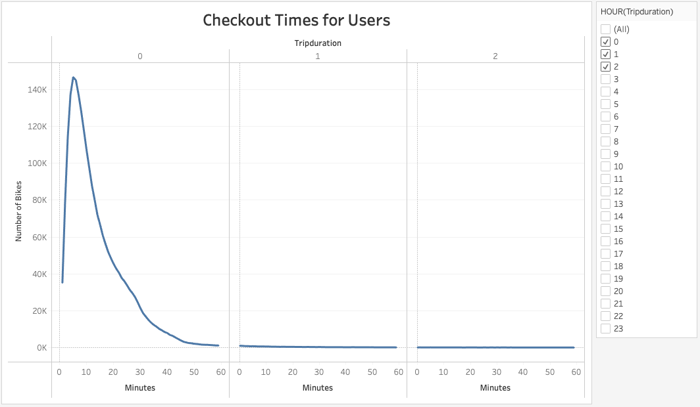

# Bikesharing
###### Module 14 Bootcamp
___________________________________

# Overview
The analysis of the bicycles is carried out to verify if it is feasible to open a branch in Des Moines.

________________________

# Results
Manhattan travel database was analyzed in August 2019. Obtaining these results:

## Most demanding hours
- The most important hours of use are at 8 in the morning and from 5 to 7 at night.

_____________________________

## Starting and Ending points

- The most used starting points of the trip are in the center of the city.

- The most used ending points of the trip are in the center of the city.

___________________________

## Travel duration

- Most trips are less than 40 minutes

- Men's trips are mostly less than 20 minutes and they use the service the most.

___________________________
## Hour and day of greatest demand

- Thursdays from 5 to 7 in the afternoon have the highest demand for use.

- Men are the ones who use the service the most on Thursdays from 5 to 7 in the afternoon

___________________________
## Client vs suscriber

- The market for men with a subscription is the one that uses the service the most.

Please feel free to visit the analysis page: [Tableau Analysis](https://public.tableau.com/views/bikesharingChallenge/BikeSharing?:language=en-US&:retry=yes&publish=yes&:display_count=n&:origin=viz_share_link).

# Summary

The market that most demands the service are male subscribers. The busiest hours are from 5 to 7 in the afternoon. Thursdays are the days with the highest demand.

It is necessary to verify the existence of this market in Des Moines

## Desirable analysis

It is desirable to have the same graphs for the years 2020 and 2021. To see if there was an increase or decrease in the demand or any change in the demand of women for the service.

Des Moines's population is 215,636. compared to New York's population of 8,419 million. It is a number without concordance, it is advisable to review data from a city that more closely resembles the population of Des Moines

### Conclusion 
It is not possible to define the success or failure of the opening of the business, since the conditions of the analysis data are of a macro city compared to the desired location.

